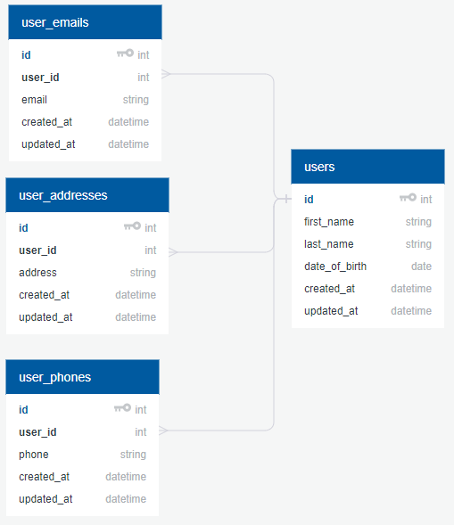

## Application requirements

### Description

A Web application for managing contacts. It stores a list of persons. A Person could contain following properties:

- First name
- Last name
- Date of birth
- Zero or more addresses
- One or more phone numbers
- One or more emails

### Features

- Managing contacts
    - Creating a contact
    - Removing a contact
    - Updating contact details (name, dob, emails, etc)
    - Viewing contact details
- Search
    - By contact name (first/last name)
    - By date of birth
    - By address
    - By phone number
    - By email

Application should be available without login and/or signup steps.

### Architecture

#### Database scheme

First thing we have to do is to come up with a simple database scheme for our application. We'll use [QuickDBD](https://www.quickdatabasediagrams.com) for that purpose.

- For first/last name we would have a cap of 100 characters per field.
- Date of birth is simply a `date` datatype
- Addresses could be as long as 120 characters. Let's make it 150 to be extra safe. Who knows if someone is gonna add some person from [Taumatawhakatangihangakoauauotamateaturipukakapikimaungahoronukupokaiwhenuakitanatahu](https://en.wikipedia.org/wiki/Taumatawhakatangihangakoauauotamateaturipukakapikimaungahoronukupokaiwhenuakitanatahu) (85 letters)
- Phone numbers are limited by 15 digits, 20 should be safe enough.
- Emails could be of any length, but let's assume that we would not process anything above 100 characters.

The approach is pretty much straightforward. A single `users` table with necessary fields `first_name`, `last_name`, `date_of_birth` and a pair of `created_at`, `updated_at` fields.
The reason why I've decided to use three additional tables for storing emails, phones and addresses is because we would have to implement a search later. Phones, addresses and emails usually have a reasonable character limit and in that case we can have indexing on these columns.  

**Result:** we have created initial database scheme and defined reasonable limits on our data types.

#### Storage

Let's calculate how much storage we would need for every living person on the Earth.

- A single `user` record - 4B (`id`) + 100B (`first_name`) + 100B (`last_name`) + 4B (`date_of_birth`) + 8B (`created_at`) + 8B (`updated_at`) = 224B
- A single `user_email` record - 4B (`id`) + 4B (`user_id`) + 100B (`email`) + 8B (`created_at`) + 8B (`updated_at`) = 124B
- A single `user_address` record - 4B (`id`) + 4B (`user_id`) + 150B (`address`) + 8B (`created_at`) + 8B (`updated_at`) = 174B
- A single `user_phone` record - 4B (`id`) + 4B (`user_id`) + 20B (`phone`) + 8B (`created_at`) + 8B (`updated_at`) = 44B

So if we assume that every person have at least one address, phone number, and email that would leave us with `224 + 124 + 174 + 44 = 566` bytes not counting any indexes and metadata storage. Let's add 50% of that for indexes and then we would get `850` bytes for a single person record.
Multiplying it against total world population (7.6 billion as of 2018) would equal to **~6.5TB** of data. Yikes, that is some enterprise-scale dataset. We would definitely need a few very fast PCI-E SSDs to handle all of that data.

**Result:** **6.5TB** for every living person on Earth.

**So, what is the point of that calculation?**

#### SQL? NoSQL? Both!

There are at least 3 databases we could use for our needs -- PostgreSQL, MongoDB, ElasticSearch.

First, we need a persistent storage that would hold all our data safely and guarantee **real-time** (we can query for the data right after insertion) response. I cannot really think of anything except PostgreSQL or MongoDB. I'm not sure if I would like to use MongoDB at this point, I don't see what it could do better than Postgres. So I'll take the Postgres as a main backend storage solution.

Then, we have a requirement to implement a search. There are multiple approaches we can use. If our data is not large and can fit entirely into RAM then we can simply use [Redis](https://redis.io/) to cache our data and do very fast searches.
However, once our dataset would exceed `1TB` (see calculation above) it would be very difficult (or costly) to scale up even more. In best case we would have to pay an extra price for those 8TB RAM instances. In worst case we would have to separate our data (sharding). In that case the more cost and resource-effective solution for full-text search engine would be [ElasticSearch](https://github.com/elastic/elasticsearch). It could be scaled horizontally much easier than with Redis and it already have all the features we need.

The problem with ES is that it could not be really used in the same way as Postgres. It needs to rebuild an index after every create/update/remove query. It provides **near real-time** search. So, we still have to rely on Postgres in case something would go wrong.

So why not use both? Sure, storage requirements would double but we would have a really fast search engine that is crucial to our application, while having a "backend protection layer" from Postgres. It would also make sense to have a few backup copies for our data, just in case.

**Result:** We have picked Postgres for persistent data storage and ElasticSearch for indexing and full-text searches.

#### Virtualization, containers, provisioning

At this moment we have at least two solutions for fast and reliable provisioning: [Vagrant](https://github.com/hashicorp/vagrant) and [Docker](https://github.com/docker/docker-ce). Previously I had experience only with Vagrant and even though it helped me to isolate applications and services from everything else, I haven't discovered a good way of managing multiple services at the same time. Few weeks ago I've decided to look at Docker and it simply blew my mind. We can use `docker-compose` to create and manage multiple services at once. They are available to each other over internal Docker network and the development experience is really a step up from what I did previously with Vagrant. So I've decided to use Docker and images based on Alpine Linux for main services to reduce container sizes as much as possible.

**Result:** Docker for container management, provisioning, development, and deployment.

#### Separating backend and frontend services

Luckily, we don't need to have signup or login features for our application. Otherwise, that could have complicated architecture a bit - storing JWT and/or session id data inside Cookies/Local Storage, etc.

However, I believe that we have already entered an age where front-end applications considered as separate services from backends they rely on. In that case, we can use CDNs to cache/serve all of our client-side code and not worry about stale/cached data from our backend services. It also improves security since we don't have to route unencrypted traffic from backend to CDN gateways. For example, CloudFlare have to decrypt any SSL traffic that comes from backend (if you would like to use HTTP/2 features), so it could become rather vulnerable point. Having frontend separated from the backend guarantees we would not leak any sensitive data through CDN providers while taking advantages of their features.

Another point is when we design our backend as REST API service, we can use it for anything, including web, mobile, desktop applications. I think it just makes it a little bit more future-proof, not to mention we don't have to install anything related to `node` and keep our container size pretty small.

One of the requirements for this application was using Vue.js as a main front-end library and Python for back-end, so I've choosed Django.

**Result:** Vue.js front-end SPA, Django back-end as REST API.

#### Unit testing, TDD/BDD

One of the main reasons why software fails to deliver it's value is that it is very hard to maintain and test everything once application exceeds certain **"lines of code"** threshold. You cannot be sure that your application is bug-free, ever. Good amount of discipline is required to keep codebase maintainable.

That is where unit-testing helps. Proper unit testing allows you to design your code in a way that is considered maintainable. [SOLID](https://en.wikipedia.org/wiki/SOLID) principle is mainly used together with unit-testing. It requires additional effort to get used to writing tests, but believe me, it is worth it.

The approach for writing tests is very simple:

1. Write failing test
2. Add minimal amount of code to make it green
3. Refactor

In this application, I would be using Mamba together with Expects assertion library for testing Django. Vue.js have Mocha and Chai by default. For fixtures I would like to use more dynamic Factory approach using [factory_boy](https://github.com/FactoryBoy/factory_boy) package together with [faker](https://github.com/joke2k/faker/). For frontend side I'll be using [factory-girl](https://github.com/aexmachina/factory-girl) since it is the only thing I've found close enough to `factory_boy` package. Fortunately, there is a Javascript version of `faker`: [faker.js](https://github.com/Marak/Faker.js). 

**Result:** Mamba/Expects for Django, Mocha/Chai for Vue.js.

#### Serving application

[nginx-proxy](https://github.com/jwilder/nginx-proxy) is pretty simple to add and use for our Docker Compose configuration. We just have to expose ports on our service containers and this container would automagically discover and write configuration to serve them. It also supports SSL, domain names, and Let's Encrypt. That is exactly what we need.
