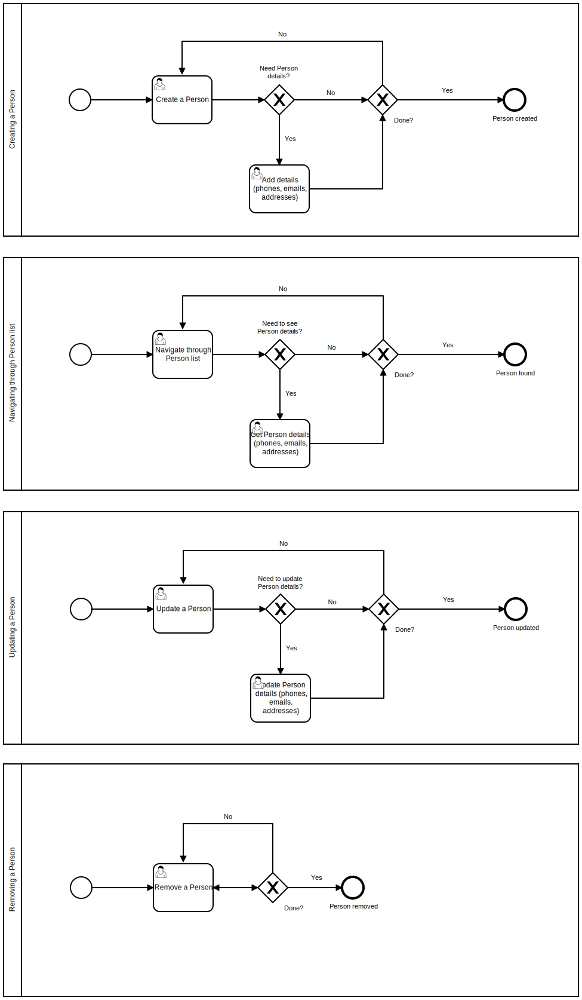

## Implementation

#### Designing API

First thing we should do before making any assumptions about the API is to draw simple processes for our User interacting with the application. For this purpose we will use [BPMN Viewer and Editor](https://bpmn.io/).



I'm not good at BPMN diagrams but this should be good enough to use as a high-level overview of the domain.

As far as I'm concerned, there are at least two ways to design an API. First one is simply mapping database entities as CRUD resources using HTTP verbs (POST, GET, PUT, DELETE). But [RESTful web services shouldn't be that way](https://hackernoon.com/process-driven-rest-api-design-75ca88917582). Here is the example how that API could look like:

```
# Users - `users`
POST /users/ { first_name: 'John', last_name: 'Smith', date_of_birth: '1989-11-27Z' }
GET /users/?limit=20&start=0
PUT /users/1 { first_name: 'Bob', last_name: 'Smith', date_of_birth: '1982-11-27Z' }
DELETE /users/1

# User addresses - `user_addresses`
POST /users/1/addresses/ { address: '681 Gainsway Street, Canandaigua, NY 14424' }
GET /users/1/addresses/?limit=20&start=0
PUT /users/1/addresses/1 { address: '363 SE. Beech Avenue, Whitestone, NY 11357' }
DELETE /users/1/addresses/1

# etc for `user_phones`, `user_emails`...
```

Second approach is a little bit more complicated since it requires you to actually think about users consuming your API. As we can see from the BPMN diagram, it seems we can design our API to be a little bit more efficient in terms of network usage. Instead of making additional requests for getting every type of user detail (phones, emails, addresses), we can create endpoint for getting initial user list:

```
GET /users/details/?limit=20&start=41
```

As an example response we'll get 20 users with all necessary details.

```json
{
    "meta": {
      "total-pages": 5
    },
    "users": [
      {
        "id": 1,
        "first_name": "John",
        "last_name": "Smith",
        "date_of_birth": "1982-11-28",
        "link": {
          "rel": "self",
          "href": "http://api.example.com/users/1"
        },
        "addresses": [
          {
            "id": 1,
            "address": "681 Gainsway Street, Canandaigua, NY 14424",
            "link": {
              "rel": "self",
              "href": "http://api.example.com/users/1/addresses/1"
            }
          }
        ],
        "phones": [
          {
            "id": 1,
            "phone": "+12025550160",
            "link": {
              "rel": "self",
              "href": "http://api.example.com/users/1/phones/1"
            }
          }
        ],
        "emails": [
          {
            "id": 1,
            "email": "john.smith@example.com",
            "link": {
              "rel": "self",
              "href": "http://api.example.com/users/1/emails/1"
            }
          }
        ]
      },
      ...
    ],
    "links": {
      "self": "http://api.example.com/users/details/?limit=20&start=41",
      "first": "http://api.example.com/users/details/?limit=20&start=1",
      "prev": "http://api.example.com/users/details/?limit=20&start=21",
      "next": "http://api.example.com/users/details/?limit=20&start=61",
      "last": "http://api.example.com/users/details/?limit=20&start=81"
    }
}
```


The client app could cache the query results and allow user to edit and probably search records even if network is too slow or completely offline.

The next use case is creating a new Person:

```
POST /users/ { first_name: 'John', last_name: 'Smith', date_of_birth: '1989-11-27Z', email: 'john.smith@example.com', phone: '+12025550160' }
```

Application requirements mention that **Person could contain one or more emails and one or more phone numbers**. That means we must create `user`, `user_phones`, and `user_emails` records in a single request. Simply mapping our database scheme to CRUD operations would not make much sense in this case. Fortunately, Resources in REST API could be anything we would like &mdash; like getting traffic directions from Seattle to San Francisco (`GET /directions/?from=Seattle&to=SanFrancisco`), generate random numbers (`GET /random/?min=1&max=100`), etc.
 
In this case, we have simply added two more required fields: `email` and `phone`. Behind the scenes, our API would create `user`, `user_phones`, and `user_emails` records. Thereby, client app developer doesn't even need to think about relations in our database. He doesn't have to write code to make 3 subsequent requests, and we have also saved bandwidth and reduced overall complexity for our API.

Next thing we need to implement inside **Creating a Person** process is **Add details (phones, emails, addresses)**:

```
POST /users/1/details { phones: ['+12025550160'], emails: ['john.smith@example.com'], addresses: ['681 Gainsway Street, Canandaigua, NY 14424'] }
PUT /users/1/details { phones: [{ id: 1, phone: '+12025550160' }, { id: 2, phone: '+12025550162' }] }
```

These endpoints should be easy enough to remember and use. I like API that doesn't care if you want to create records in bulk or one by one. Just provide an array every time. By accepting arrays in first place we are telling to consumer that our API could create multiple records at once. That could be useful in case someone would build an application with offline capabilites and background sync. For example, it could store a list of created details and then send a request to add them in bulk.

Another way of using that endpoint is simply providing a single phone/email/address, in case when user using application with a working network and expect to see that his changes are being saved in real-time, after every action. Again, if he suddenly loses connection, his changes should be pushed to some kind of stack, where service worker should be able to pick up unsaved changes and [sync them with the server](https://developers.google.com/web/updates/2015/12/background-sync).

Now, updating and deleting parts. It would make sense to use the same resource URIs we have been returning from `GET /users/details/` for `PUT` and `DELETE` queries:

```
PUT /users/1 { first_name: 'John', last_name: 'Smith', date_of_birth: '1989-11-27Z' }
PUT /users/1/addresses/1 { address: '681 Gainsway Street, Canandaigua, NY 14424' }
PUT /users/1/phones/1 { phone: '+12025550160' }
PUT /users/1/emails/1 { email: 'john.smith@example.com' }

DELETE /users/1
DELETE /users/1/addresses/1
DELETE /users/1/phones/1
DELETE /users/1/emails/1
```

Another thing we need to implement is search. Let's make it simple and just provide a single endpoint that would do full-text searches and return same response as `GET /users/details/?` but filtered according to search string. It could be anything &mdash; name, email, phone number, address. We'll be using ElasticSearch for that. After that we could add more refined searches by email, phones, addresses, etc.

```
GET /search/?s=John+Smith
```

#### API endpoints

OK, looks like now we have initial API specification for our application:

```
### Managing Contacts

# Create
POST /users/ { first_name: 'John', last_name: 'Smith', date_of_birth: '1989-11-27Z', email: 'john.smith@example.com', phone: '+12025550160' }

# Remove
DELETE /users/1
DELETE /users/1/addresses/1
DELETE /users/1/phones/1
DELETE /users/1/emails/1

# Update (details)
POST /users/1/details { phones: ['+12025550160'], emails: ['john.smith@example.com'], addresses: ['681 Gainsway Street, Canandaigua, NY 14424'] }
PUT /users/1/details { phones: [{ id: 1, phone: '+12025550160' }, { id: 2, phone: '+12025550162' }] }
PUT /users/1 { first_name: 'John', last_name: 'Smith', date_of_birth: '1989-11-27Z' }
PUT /users/1/addresses/1 { address: '681 Gainsway Street, Canandaigua, NY 14424' }
PUT /users/1/phones/1 { phone: '+12025550160' }
PUT /users/1/emails/1 { email: 'john.smith@example.com' }

# View
GET /users/details/?limit=20&start=41
GET /users/1/details/

### Search (by contact name, dob, address, phone number, email)
GET /search/?s=John+Smith
```

One more thing we need to consider &mdash; duplicate phone/email/address records. We will only consider identical addresses since we are storing them as an arbitrary string though. For simplicity's sake I'd suggest that we should skip any duplicates for `POST /users/1/details` and simply return `HTTP/1.1 200 OK` with the same body as `GET /users/1/details/` on every valid request. That behaviour needs to be explicitly documented.

However, considering `PUT /users/1/details` it would be weird to implement same behaviour. We should return `HTTP/1.1 409 Conflict` because we can't have two details records with the same value.
For any validation errors we can use `HTTP/1.1 400 Bad Request` according to [RFC7231](https://tools.ietf.org/html/rfc7231).

That's pretty much it.

#### TDD approach for creating Django API

At first, we can focus on creating Postgres tables and getting basic CRUD operations in place.